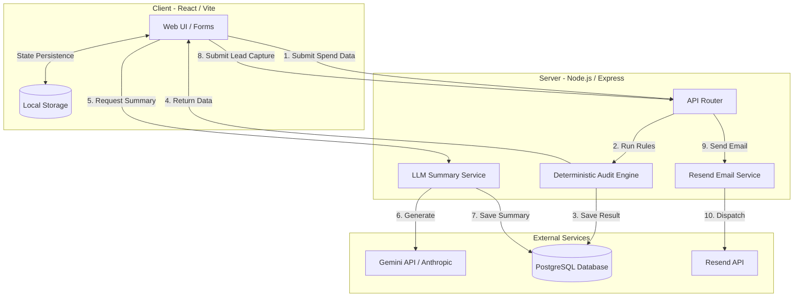

# Architecture

## 1. System Diagram

---

## 2. Data Flow: From Input to Audit Result

1. **Client-Side Capture:** The user inputs their tools, seats, and spend. The state is instantly persisted to `localStorage` so they don't lose data on reload. Client-side validation ensures no empty inputs are sent.
2. **Deterministic Processing:** The frontend sends a JSON payload to the backend `POST /api/v1/audit`. The backend skips AI entirely for this step. It feeds the data into the **Audit Engine**, which runs through hardcoded `planRules` checking the user's input against the verified data in `PRICING_DATA.md`.
3. **Storage & Response:** The audit engine calculates total savings, flags overspending, and saves a record of the audit in the PostgreSQL database via Prisma. It returns an `auditId` and the math breakdown to the frontend.
4. **Asynchronous Summary:** The frontend routes the user to the Results page and immediately displays the financial savings. In the background, it calls the summary endpoint with the `auditId`.
5. **LLM Generation:** The backend fetches the audit results from the database, constructs a highly specific prompt, and queries the LLM. The qualitative summary is streamed/returned to the client and cached in the database.
6. **Lead Capture & Viral Loop:** If the user enters their email, the backend updates the audit record and triggers a transactional email via Resend containing their unique shareable public URL.

---

## 3. Why This Stack?

**Frontend: React (Vite) + TailwindCSS + TypeScript**
- *Why:* React provides the reactivity needed for a complex dynamic form. Vite is significantly faster than CRA or Webpack. Tailwind allows for rapid, premium styling without context switching. TypeScript prevents runtime type errors between the complex form state and the API payload.

**Backend: Node.js + Express.js**
- *Why:* Instead of building a monolith with Next.js, separating the backend isolates the API layer. This prevents vendor lock-in to Vercel's serverless environment, making it easy to deploy the backend on a persistent Node server (Render/Fly.io) avoiding serverless cold starts.

**Database: PostgreSQL + Prisma ORM**
- *Why:* Relational data makes sense here (an Audit has many Tools, an Audit belongs to a Lead). Prisma provides end-to-end type safety, making sure the backend API shapes strictly match the database schema.

**Core Decision: Deterministic Math over AI**
- *Why:* The most important architectural decision was **not** using an LLM to calculate savings. LLMs hallucinate math. By writing a deterministic rules engine, the financial output is 100% reliable, testable, and defensible. The LLM is used strictly as a presentation layer for the summary.

---

## 4. Scaling to 10k Audits / Day

If this tool hits the top of Hacker News and needs to handle 10,000 audits a day, the current synchronous architecture would hit bottlenecks, specifically around external API rate limits and connection timeouts. Here is what I would change:

1. **Decouple the LLM via Background Workers (BullMQ / Redis):**
   Right now, the summary generation holds the HTTP request open while waiting for the LLM. At 10k requests/day, this would exhaust connection pools. I would move LLM generation and Email Dispatch to a Redis-backed queue (like BullMQ). The frontend would poll or use Server-Sent Events (SSE) to receive the summary when the worker finishes.
2. **Edge Caching for Public URLs:**
   Public shared URLs (`/audit/shared/:id`) are read-heavy. I would implement caching at the CDN level (Cloudflare/Vercel Edge) so viral Twitter links don't repeatedly hit the database for the exact same read-only data.
3. **Aggressive Rate Limiting:**
   At high volume, abuse of the free LLM generation endpoint is a massive financial risk. I would implement Redis-based sliding-window rate limiting per IP address, and enforce strict hCaptcha validation before hitting the backend LLM endpoint.
4. **Database Connection Pooling:**
   I would deploy PgBouncer (or use Prisma Accelerate) to manage database connections efficiently, preventing the Postgres database from being overwhelmed by simultaneous writes during traffic spikes.
