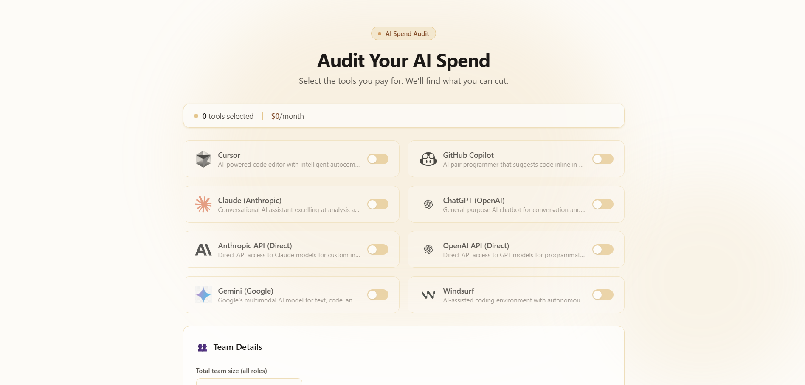
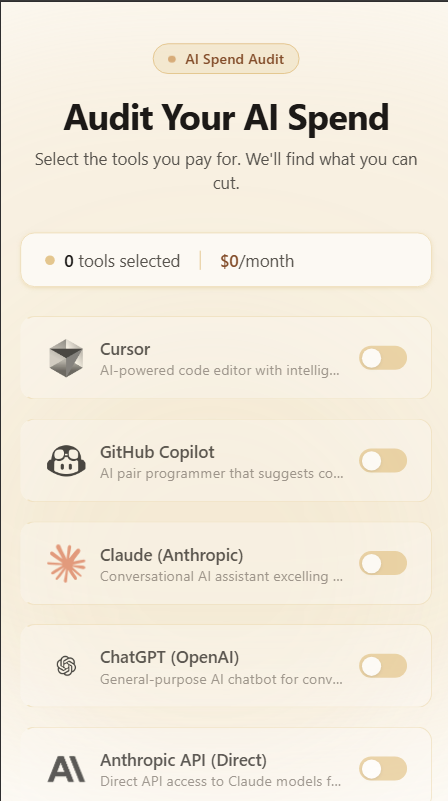
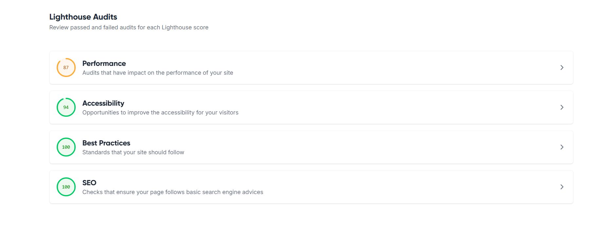

# AI Spend Audit - Credex

**Live URL:** https://ai-spend-audit-assignment.vercel.app/
**GitHub Repository:** https://github.com/SurajPatel04/ai-spend-audit-assignment

### What is this?
AI Spend Audit is a lead-generation web application for startup founders and engineering managers to identify unnecessary AI tooling spend. Users enter their current stack (Cursor, Claude, ChatGPT, Copilot, etc.) and instantly receive a defensible audit showing overspending, redundant subscriptions, cheaper alternatives, and projected monthly + annual savings.

## Features

- AI tooling spend audit engine
- Per-tool optimization recommendations
- Monthly + annual savings projections
- AI-generated personalized summaries
- Shareable public audit URLs
- Lead capture + transactional email flow
- Persistent form state across reloads
- Tiered rate limiting + abuse protection
- Mobile-responsive UI

---

### Screenshots




---

## Tech Stack

### Frontend
- React
- TypeScript
- Vite
- TailwindCSS

### Backend
- Node.js
- Express
- Prisma
- PostgreSQL

### AI + Infrastructure
- LangChain
- Gemini 2.5 Flash
- Resend
- Vitest
- GitHub Actions

---

## Testing & CI

- 77 automated tests across audit engine, controllers, services, and API routes
- Vitest + Supertest
- GitHub Actions CI runs lint + tests on every push to main

---

## Lighthouse Scores
audit on deployed production build:

- Performance: 87
- Accessibility: 94
- Best Practices: 100
- SEO: 100

### Lighthouse Report Screenshot


### Full Lighthouse Report
https://lighthouse-metrics.com/lighthouse/checks/307cd239-cb75-4510-9bda-eddb5d08f1a9

---

## Environment Variables

### Backend
- `DATABASE_URL`
- `GEMINI_API_KEY`
- `RESEND_API_KEY`
- `FRONTEND_URL`

### Frontend
- `VITE_API_URL`

---

### Quick Start

#### 1. Backend Setup
```bash
cd backend
npm install
cp .env.example .env 

# Setup the database
npx prisma generate
npx prisma db push

# Start the development server
npm run dev
```

#### 2. Frontend Setup
```bash
cd frontend
npm install
npm run dev
```

#### 3. Deploy
- **Frontend:** Deploy to Vercel/Netlify. Set build command to `npm run build`. Set `VITE_API_URL` to backend URL.
- **Backend:** Deploy to Render/Fly.io. Set start command to `npm start` and build command to `npm run build`. Ensure `npx prisma generate` runs.

---

### Decisions (Trade-offs made)

1. **Rule-based Audit Engine vs. LLM-based Engine:**
   *Why:* I chose to use hardcoded math and rules for the core financial audit instead of relying on an LLM to calculate savings. LLMs are prone to hallucinations with math and pricing updates. Using explicit logic ensures the financial advice is 100% deterministic, defensible, and accurate based on `PRICING_DATA.md`. The LLM is reserved strictly for the qualitative summary.
2. **Local Storage for Form State Persistence:**
   *Why:* I used `localStorage` to persist the spend input form. Since users are cold visitors and there is no login required, saving the form state locally allows them to accidentally close or refresh the page without losing their inputs, significantly reducing friction and abandonment.
3. **Decoupled Summary Generation:**
   *Why:* The AI-generated summary is fetched asynchronously on the results page. Calling an LLM API takes several seconds; by decoupling it, the user instantly sees their quantitative savings (the "hook") while the personalized text loads. This dramatically improves perceived performance.
4. **Express.js + Prisma over Next.js API Routes:**
   *Why:* Separating the frontend and backend simplified deployment, testing, and API isolation while keeping the architecture flexible across hosting providers. Prisma provides excellent type safety and handles migrations efficiently for storing the lead capture and audit data.
5. **Value-First Lead Capture (No Email Gate Upfront):**
   *Why:* The goal of this tool is to build trust through immediate value. Gating the entire tool behind an email input would drastically lower conversion rates. Instead, email is requested *after* the savings are revealed, ensuring that the leads captured are high-intent and actually interested in a Credex consultation.

---

## Future Improvements

- Benchmark mode across company sizes
- PDF export
- Invoice ingestion
- Historical spend tracking
- Screenshot sharing cards
- Vendor consolidation recommendations
